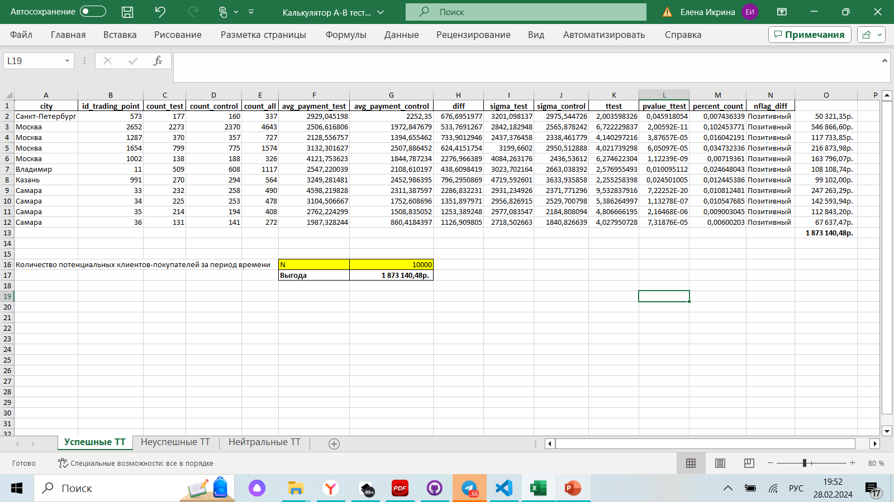

  
  

  

 

Анализ эксперимента проводится крупным ритейлером *SkyLenta*, который присутствует во многих российских городах.
___
# Описание эксперимента (АВ-теста) :hotsprings:

  
 Разверни,чтобы увидеть 

### Цель эксперимента 

Исследование альтернативного метода воздействия на клиентские покупки с помощью пуш-уведомлений.

Воздействие “***контроль***” - уведомление о новых товарах и скидках с помощью баннера в приложении

Воздействие “***тест***” - уведомление с помощью пуша (сообщение о товарах и скидках появится в уведомлениях приложения).

### Дизайн эксперимента

Длительность эксперимента - 3 месяца.

География: в эксперименте задействованы все города присутствия в России.

### Сплит-система

Клиенты разбиты на две группы одинакового размера случайным образом. 

### Таргет-метрики

- Конверсия из рекламы в покупку
- Средний чек 

___
#Задача :hotsprings:

После проведения теста необходимо проанализировать и визуализировать результаты, провести сегментацию, а также сделать выводы и сформулировать рекомендации для дальнейших запусков АБ Теста.

Также надо построить таблицу, которая будет в удобной форме хранить результаты АБ Теста.

Полученную таблицу необходимо выгрузить в Excel. 

Три различных исхода должны быть выгружены на отдельные листы.

На основании этого Excel-файла будет построен калькулятор.
___
# Описание данных :hotsprings:

  

Результаты АБ-Теста лежат в файле "Новый диплом датасет.xlsx"

Вкладка “Данные”
- id_order - уникальный идентификатор покупки.
- id_client - уникальный идентификатор клиента.
- amt_payment - размер платежа.
- dtime_pay - дата и время оплаты.

Вкладка “Clients”
- id_client - уникальный идентификатор клиента.
- dtime_ad - дата и время показа рекламного объявления (или баннером в приложении, или пуш-уведомлением, в зависимости от группы).
- nflag_test - группа эксперимента (0 - контроль, 1 -тест).
- id_trading_point - идентификатор торговой точки, к которой прикреплен данный пользователь.

Вкладка “Region_dict”
- id_trading_point - уникальный идентификатор торговой точки, к которой прикреплен данный пользователь.
- city - название города. 

____

# Результаты АВ-теста. Выводы :hotsprings:

 ## Общие результаты
- Средние платежи контрольной и тестовой групп не равны.
- Разница средних  платежей: 158, 91 руб.
- Средняя конверсия  в платеж контрольной и тестовой групп не равны.
- Разница конверсий: 25,2 %
- Распределения в контрольной и тестовой группе также не равны.

## Результат по городам

- Количество  и сумма платежей по г. Москва выше, чем по г. Санкт-Петербург.
- В г. Москва для следующих исследований можно провести сегментацию: выделить премиум сегмент.
- Для ряда торговых точек количество наблюдейний статистически недостаточно, чтобы сделать хоть сколько-то достоверные выводы.

## Выводы

Все торговые точки в различных городах по итогам АБ теста были разделены на 3 группы:
- Успешные  (результаты тестовой группы лучше контрольной);
- Неуспешные  (результаты тестовой группы хуже контрольной);
- Нейтральные  (невозможно сделать вывод ввиду малого количества наблюдений).

При количестве клиентов 10000:
 - Выгода от внедрения отправки пуш-уведомлений составит **1 873 140,48**р. 
 - Убыток от внедрения отправки пуш-уведомлений составит  **256 137,44**р. 
- Общий эффект от внедрения: **1 617 003,04**р. 

По группе нейтральных торговых точек было рассчитано количество наблюдений, необходимое для получения разницы по средним платежам контрольной и тестовой групп в 1000 руб. (MDE – minimal detectable effect).

По нейтральным точкам эксперимент предлагается продолжить для увеличения числа наблюдений хотя бы до минимально необходимого.

Для успешных торговых точек предлагается внедрить пуш-уведомления.
