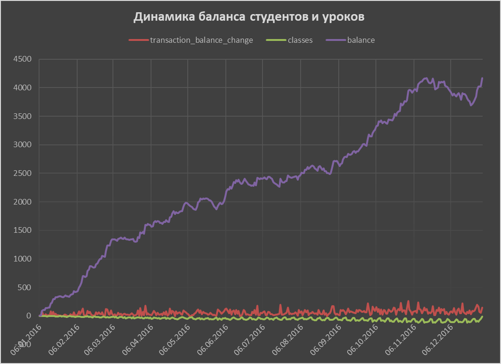

  
  

  

 

# Задача
Дана база данных онлайн-школы SkyEng студентов, учителей, уроков и пр. 
__Задача__ — смоделировать изменение балансов студентов. Баланс — это количество уроков, которое есть у каждого студента. 

1. Необходимо проверить данные в базе и ответить на вопросы:

   - Сколько всего уроков было на балансе **всех учеников** за каждый календарный день;

   - Как это количество менялось под влиянием транзакций (оплат, начислений, корректирующих списаний) и уроков (списаний с баланса по мере прохождения уроков);

   - Создать таблицу, где будут балансы **каждого студента** за каждый день. В результате должен получиться SQL-запрос, который собирает данные о балансах студентов за каждый "прожитый" ими день.

2. Выбрать топ-1000 строк из CTE `balances` с сортировкой по `user_id` и `dt`. Посмотреть на изменения балансов студентов. 

3. Создать визуализацию (линейную диаграмму) итогового результата. Сделать выводы.

___
# Описание базы данных

  

    SKYENG_DB (Metabase) 

    
***classes***
    
***Витрина с уроками***
    
- **user_id** - уникальный идентификатор юзера
- **id_class** - уникальный идентификатор урока
- **class_start_datetime** - время начала урока
- **class_end_datetime** - время конца урока
- **class_removed_datetime** - время удаления записи о данном уроке
- **id_teacher** - уникальный идентификатор учителя
- **class_status** - статус урока (успешно проведен / отменен и тд)
- **class_status_datetime  -** время проставления статуса по уроку
    
**payments**
    
***Витрина с платежами по урокам***
    
- **user_id** - уникальный идентификатор юзера
- **id_transaction** - уникальный идентификатор транзакции
- **operation_name** - название проведенной операции
- **status_name** - статус проведенной операции (исполнена / не исполнена и тд)
- **classes** - количество оплаченных уроков
- **payment_amount** - выплаченная сумма
- **transaction_datetime** - время проведения операции
    
**students**
    
***Витрина со списком студентов***
    
- **user_id** - уникальный идентификатор юзера
- **student_sex** - пол юзера
- **geo_cluster** - географическая агрегация
- **country_name** - короткое название страны
- **region_name** - название региона
- **email_domain** - домен электронной почты
    
**teachers**
    
***Витрина со списком учителей***
    
- **id_teacher** - уникальный идентификатор учителя
- **age** - возраст
- **city** - город проживания учителя
- **department** - направление, в котором работает учитель
- **max_teaching_level** - название уровня языка у преподавателя
- **id_teaching_level** - уникальный идентификатор уровня языка у преподавателя
- **language_group** - основной язык преподавателя

____

# Решение

  
 
Шаг 1. Поиск первой транзакции каждого студента. 
 
Узнаем, когда была первая транзакция для каждого студента. Начиная с этой даты, мы будем собирать его баланс уроков. 
Создадим CTE `first_payments` с двумя полями: `user_id` и `first_payment_date` (дата первой успешной транзакции).

  

Шаг 2. Сбор всех уникальных дат уроков.
  

Соберем таблицу с датами за каждый календарный день 2016 года. Выберем все даты из таблицы `classes`.
Создадим CTE `all_dates` с полем `dt`, где будут храниться уникальные даты (без времени) уроков.

  

Шаг 3. Создание таблицы дат жизни студента после его первой транзакции.

Узнаем, за какие даты имеет смысл собирать баланс для каждого студента. Для этого объединим таблицы и создадим CTE all_dates_by_user, где будут храниться все даты жизни студента после того, как произошла его первая транзакция. 
В таблице должны быть такие поля: user_id, dt. 

  
 Шаг 4. Поиск изменения балансов успешных транзакций.
  

Найдем все изменения балансов, связанные с успешными транзакциями. Выберем все транзакции из таблицы payments, сгруппируем их по user_id и дате транзакции (без времени) и найдем сумму по полю classes. 
В результате получим CTE `payments_by_dates` с полями: `user_id`, `payment_date`, transaction_balance_change (сколько уроков было начислено или списано в этот день).

  
 Шаг 5. Поиск изменений балансов от транзакций.
  

  Найдем баланс студентов, который сформирован только транзакциями. Для этого объединим `all_dates_by_user` и `payments_by_dates` так, чтобы совпадали даты и `user_id`. Используем оконные выражения (функцию `sum`), чтобы найти кумулятивную сумму по полю `transaction_balance_change` для всех строк до текущей включительно с разбивкой по `user_id` и сортировкой по `dt`. 
**В результате** получим CTE `payments_by_dates_cumsum` с полями: `user_id`, `dt`, `transaction_balance_change` — `transaction_balance_change_cs` (кумулятивная сумма по `transaction_balance_change`). При подсчете кумулятивной суммы можно заменить пустые значения нулями.

  
 Шаг 6. Поиск изменений балансов от прохождения уроков.
  

Найдем изменения балансов из-за прохождения уроков. 
Создадим CTE `classes_by_dates`, посчитав в таблице `classes` количество уроков за каждый день для каждого ученика. 
Нас не интересуют вводные уроки и уроки со статусом, отличным от `success` и `failed_by_student`. 
**Получим результат** с такими полями: `user_id`, `class_date`, `classes` (количество пройденных в этот день уроков). Причем `classes` мы умножим на `-1`, чтобы отразить, что `-` — это списания с баланса.

  
 Шаг 7. Создание таблицы для хранения накопительной суммы количства пройденных уроков.
  

По аналогии с уже проделанным шагом для оплат создадим CTE для хранения кумулятивной суммы количества пройденных уроков. 
Для этого объединим таблицы `all_dates_by_user` и `classes_by_dates` так, чтобы совпадали даты и `user_id`. Используем оконные выражения (функцию `sum`), чтобы найти кумулятивную сумму по полю `classes` для всех строк до текущей включительно с разбивкой по `user_id` и сортировкой по `dt`. 
**В результате** получим CTE `classes_by_dates_dates_cumsum`с полями: `user_id`, `dt`, `classes` — `classes_cs`(кумулятивная сумма по `classes`). При подсчете кумулятивной суммы обязательно нужно заменить пустые значения нулями.

  
 Шаг 8. Создание таблицы баланса каждого студента.
  

Создадим CTE `balances` ****с вычисленными балансами каждого студента. Для этого объединим таблицы `payments_by_dates_cumsum` ****и `classes_by_dates_dates_cumsum` так, чтобы совпадали даты и `user_id`.

**Получим такие поля:** `user_id`, `dt`, `transaction_balance_change`, `transaction_balance_change_cs`, `classes`, `classes_cs`, `balance` (`classes_cs` + `transaction_balance_change_cs`).

  
 Шаг 9. Поиск общего изменения количества уроков на балансах.
  

Посмотрим, как менялось общее количество уроков на балансах студентов.

Для этого просуммируем поля `transaction_balance_change`, `transaction_balance_change_cs`, `classes`, `classes_cs`, `balance` из CTE `balances` с группировкой и сортировкой по `dt`.

  
 Код SQL-запросов (также в файле "Запросы.sql"). 

	with first_payments as (
		select   user_id
				, min(date(transaction_datetime)) as first_payment_date
		from skyeng_db.payments
		where status_name = 'success'
		group by user_id
		order by user_id
		)
	-----
	, all_dates as (
		select distinct date(class_start_datetime) as dt
		from skyeng_db.classes
		where date_trunc('year', class_start_datetime) = '2016-01-01'
		order by date(class_start_datetime)
		)
	-----
	, payments_by_dates as (
		select   user_id
				, date(transaction_datetime) as payment_date
				, sum(classes) as transaction_balance_change
		from skyeng_db.payments
		where status_name = 'success'
		group by user_id, date(transaction_datetime)
		order by user_id, date(transaction_datetime)
		)
	-----
	, all_dates_by_user as (
		select *
		from all_dates ad
		right join first_payments fp
			on ad.dt >= fp.first_payment_date
			)
	-----
	, classes_by_dates as (
		select   user_id
				, date_trunc('day', class_start_datetime) as class_date
				, count(class_status)*(-1) as classes
		from skyeng_db.classes
		where class_status in ('success', 'failed_by_student')
		and date_trunc('year', class_start_datetime) = '2016-01-01'
		group by 1, 2
		order by 1, 2
		)
	-----
	, payments_by_dates_cumsum as (
		select   adbu.user_id
				, dt
				, case when transaction_balance_change is null then 0
						else transaction_balance_change end
				, case when sum(transaction_balance_change) over (partition by adbu.user_id order by dt) is null then 0
						else sum(transaction_balance_change) over (partition by adbu.user_id order by dt) end as transaction_balance_change_cs
		from payments_by_dates pbd
		right join all_dates_by_user adbu
			on pbd.user_id = adbu.user_id
			and pbd.payment_date = adbu.dt
		)
	-----
	, classes_by_dates_dates_cumsum as (
		select    adbu.user_id
				, dt
				, case when classes is null then 0
						else classes end
				, case when sum(classes) over (partition by adbu.user_id order by dt) is null then 0
						else sum(classes) over (partition by adbu.user_id order by dt) end as classes_cs
		from classes_by_dates cbd
		right join all_dates_by_user adbu
			on cbd.user_id = adbu.user_id
			and cbd.class_date = adbu.dt
		)
	-----
	, balances as (
		select    pbdc.user_id
				, pbdc.dt
				, transaction_balance_change
				, transaction_balance_change_cs
				, case when classes is null then 0 else classes end
				, case when classes_cs is null then 0 else classes_cs end
				, case when classes_cs + transaction_balance_change_cs is null
					then 0 else classes_cs + transaction_balance_change_cs end as balance
		from payments_by_dates_cumsum pbdc
		full join classes_by_dates_dates_cumsum cbddc
		on pbdc.user_id = cbddc.user_id
		and pbdc.dt = cbddc.dt
		)
	-----
	select *
	from balances
	order by user_id, dt
	limit 1000
	-----
	-- select     dt
	--          , sum(transaction_balance_change) as transaction_balance_change
	--          , sum(transaction_balance_change_cs) transaction_balance_change_cs
	--          , sum(classes) classes
	--          , sum(classes_cs) classes_cs
	--          , sum(balance) balance
	-- from balances
	-- group by dt
	-- order by dt

___
# Выводы
Результирующие таблицы выгружены в файл __"Результат запросов, визуализация"__.

1. При просмотре таблицы `payments` возникает ряд вопросов для дата-инженеров и владельцев таблицы :
- Не везде проставлен id_transaction в таблице payments (для корпоративных клиентов), почему?
- Что значит отрицательный баланс в таблице payments?

2. По визуализации можно косвенно предположить рост числа студентов, так как растет количество транзакций и общий баланс уроков.

